# Cosmic Clayton's Cosmic Minecraft Server

### **Server Address:** <a href="#" id="copyServerAddress" onclick="copyToClipboard('art-least.gl.joinmc.link')">art-least.gl.joinmc.link</a>

### [Resource Pack Download](https://vanillatweaks.net/share#7bbPXh)

### [Modpack Download](https://claytonreardon.github.io/Minecraft-Site/CosmicClayton'sCosmicModpack.zip)

### [Guide to MultiMC](https://claytonreardon.github.io/Minecraft-Site/#multimc)

## Mods
- These are moslty performance optimization and quality of life mods
- *Except* for [Create](https://modrinth.com/mod/create-fabric)
    - Watch the video above if you wanna shit
    - Create is like what redstone should have been
    - It allows you to automate and build crazy things, but it's far more understandable, *far* better explained in-game, and looks way cooler than redstone
    - Still challening and complicated though, it is not an easy mode
    - [Just Enough Items](https://modrinth.com/mod/jei) also has to be installed for Create to work
    - [WTHIT (What The Hell Is That)](https://modrinth.com/mod/wthit) tells you in game the name of the block you're looking at, helpful when dealing with new Create blocks
- [ItemSwapper](https://modrinth.com/plugin/itemswapper), [Inmis](https://modrinth.com/mod/inmis), and [Shulker Box Tooltip](https://modrinth.com/mod/shulkerboxtooltip)
    - Together, these things are the **Inventory Update** everyone has been begging for. In my mind, this should be in Vanilla
    - **Inmis (I Need More Inventory Space)** 
        - lets you craft backpacks, with increasingly large capacity for more rare materials
        - The backpacks can be conveniently opened with the **b** key, and you can swap items between your invetory and the backpack
        - The [Trinkets](https://modrinth.com/mod/trinkets) mod allows the backpack to be equipped to a dedicated *"backpack"* armor slot
    - **ItemSwapper**
        - A game changer. Press the **r** key and you can hotswap to all blocks related to the one selected in your hotbar that are in your inventory ***or*** in shulker boxes.
        - It's also *really* convenient to swap to other blocks unrelated to your selected block.
        - It also lets you quickly swap between tools, so you don't have to have half your hotbar taken up by tools
    - **Shulker Box Tooltip**
        - Literally just makes it to where if you press *shift* when hovering over a shulker box you get a compact preview of its contents, and *alt+shift* you get a full preview. That way you don't have to place down 18 shulkers every time to find something like a dingus.
- [Xaero's Minimap](https://modrinth.com/mod/xaeros-minimap) & [Xaero's Wordlmap](https://modrinth.com/mod/xaeros-world-map)
    - I really don't like Minecraft's default mapping system. It's overly complicated, clunky, and outdated.
    - Just about everything in this mod is possible in vanilla, but this just makes it much more streamlined and simple
    - Makes large scale exploring and keeping track of what you find much easier
    - Get ride of the note in your phone with coords to the skeleton spawner, just put down a waymarker in game
- [Comforts](https://modrinth.com/mod/comforts)
    - **Sleeping Bags** allow you to sleep without resetting your spawn location
    - **Hammocks** let you turn day into night, it's like the opposite of a bed
- [Tweakaroo](https://modrinth.com/mod/tweakeroo)
    - This is more on the deep lore side of things and you don't have to use it might never notice it's there
    - This mod does about a million and one things
    - I use it primarly for 3 things:
        1. *FastBlockPlacement* Press a hotkey and you can really rapidly and accurately place blocks
        2. *HotBarRandomizer* Press a hotky and then every time you place a block, a new item in your hotbar will be selected. Makes it really easy to place down randomized block Palettes
        3. *FreeCamera* Press a hotkey and you can move your camera (not the player) around freely. Really essential for building hyper-complicated contraptions in redstone and Create
- [MiniHUD](https://modrinth.com/mod/minihud)
    - Another deep lore mod that does a million and a half things
    - I primarily use it for 2 things:
        1. Render spawning spheres that will show where mods will spawn around the plater.
            - Essential for figuring out AFK platform locations for mob farms
        2. Render light levels on blocks
            - Want to mod proof your base and make sure you didn't miss anyting? Redner the light level on all blocks. 
            - *Green*, no mob spawns. *Red w yellow outline*, will only spawn mobs at night. *Red*, will always spawn mobs.
- Optimization Mods
    - It basically includes everything from the [Fabulously Optimized](https://modrinth.com/modpack/fabulously-optimized/version/6.1.0-beta.8) modpack
        - Except for Controlify cuz that mod's always buggy. All that does is let you play on PC with a controller so like eh dgaf
        - And except for FastBetterGrass because I feel like it makes grass look so ugly and it offers like negligable performance improvement so piss off

## Resource Pack
*[Download Link](https://vanillatweaks.net/share#7bbPXh)*
- The resource pack is from [VanillaTweaks](https://vanillatweaks.net/) which is a great site that lets you customize a resource pack for yourself from a bunch of quality of life tweaks. These are most of my favorite settings without differing too much from Vanilla
- The number one thing this does which I love is the *"UniversalLushGrass"* tweak, which makes grass greener and lusher all around. No more depressing washed out mountain grass, or gross brown savannah grass. Makes more biomes viable as base locations.
- You can also upload this pack to the site and remove or add the tweaks I've made

## MultiMC
*[Download Link](https://multimc.org/#Download)*
- MultiMC is an alternative Minecraft launcher. It makes it super easy to have different installations of Minecraft running different versions, with different sets of mods, resource packs and worlds. It also makes it about a million times easier to install modpacks.
    - Installing modpacks through the vanilla launcher is a giant pain in the ass without using some cringepilled third party app like Curseforge or Modrinth where you have to make some whole account and it's just like ugh sir. And then if you want to install additional mods on top of the modpack it's also stupid and cringe and it's just like bruh why.
- It's also really easy to install. It's just a zip file. Extract it wherever you want and make a shortcut to MultiMC.exe and put in your desktop

### MultiMC Installation Guide
1. Go to download link and download the version for your OS, probably Windows 

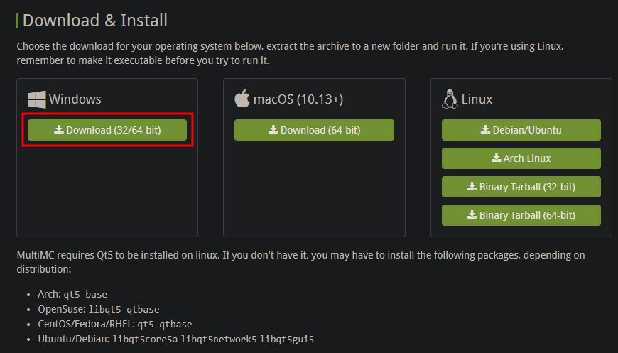

2. Once downloaded, if you open file explorer and go to your *Downloads* folder, you'll see the zip file

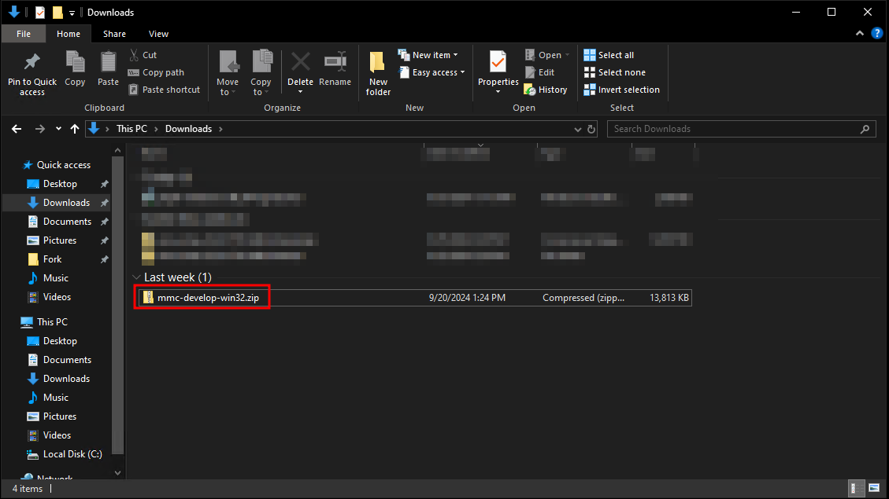

3. Double-click the zip file, and you will see another folder called *MultiMC*
4. Right-click and copy this file

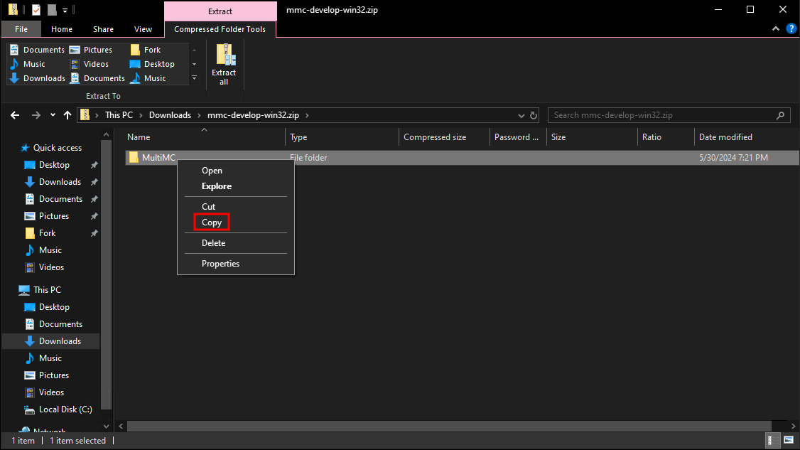

4. Navigate to your *Documents* folder
5. Right click, and create a new folder called *Games* (if you don't already have one)

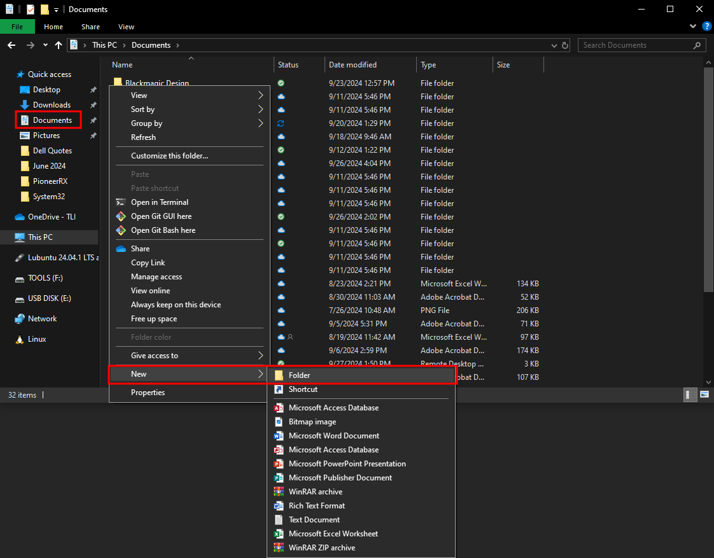

6. Enter the *Games* folder, right-click and *Paste* the *MultiMC* folder

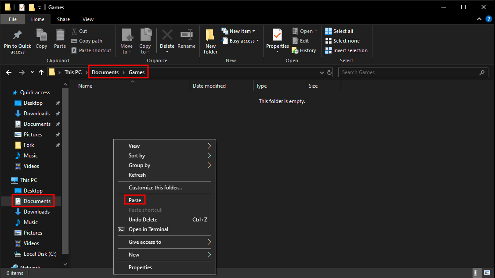
7. Then double-click the MultiMC folder to enter it
8. Scroll down until you see the *MultiMC.exe* file
9. Right click this and select *Create shortcut*

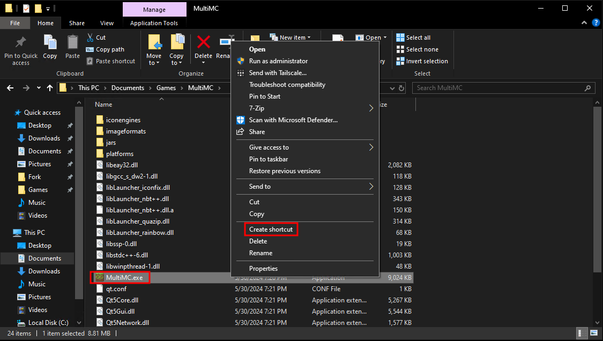

10. Once the shortcut is created, drag it to your *Desktop* folder
    - you can also directly drag it onto your desktop

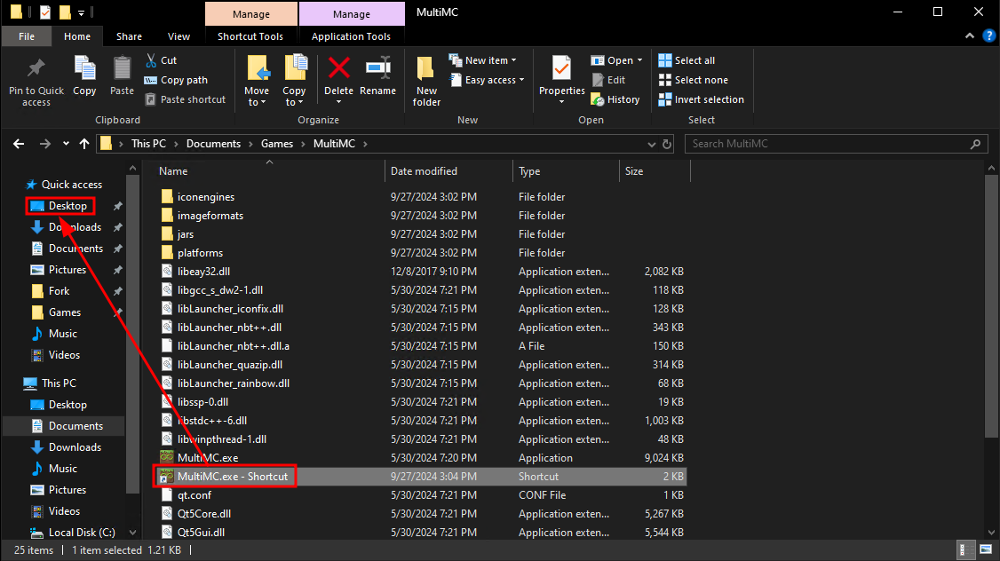

11. Once it's on your desktop, you can right-click to rename it

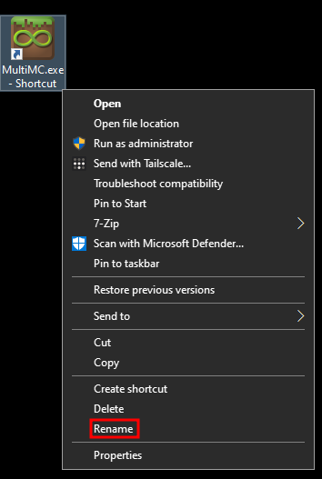

#### MultiMC Setup
When you first launch MultiMC, there's a brief setup step. The first is to choose your language, easy. The second, is to install Java. Now, you likely already have Java installed and it will be autodetected.

However, if no version of Java is detected, you can download the Java 17 JRE [from here](https://adoptium.net/temurin/releases/?os=windows&arch=x64&package=jre&version=17). Download the .msi version

When installing, you can leave everything as default, *except* make sure to change the options *Set or override JAVA_HOME variable* and *JavaSoft (Oracle) registry keys* to *install on local hard drive*

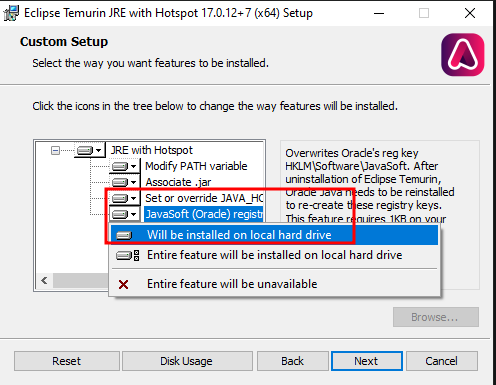

Now, when you run MultiMC setup, it *should* autodetect your Java install.

*If it doesn't*, click the *Browse* button and navigate to ***This PC>Local Disk>Program Files>Eclipse Adoptium>jre-17.0.12.7-hotspot>bin*** and select the ***javaw.exe*** file

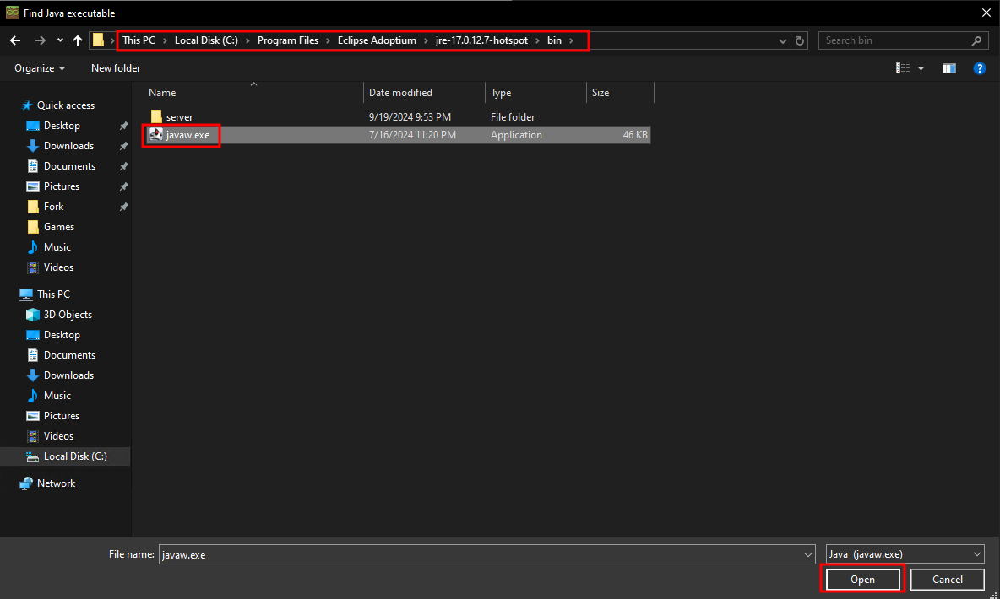

**Maximum Memory Allocation** - This is a setting that's in the vanilla launcher but it kind of hides it from you. This is maybe the single best thing to improve performance. This is the amount of RAM that Java is allowed to use when running. So if you have some beefy system with 64gb of RAM but only allow Java to use the default 2gb, you're wasting performance.

I would reccomend setting your *Maximum Memory Allocation* 4-8GB lower than however much RAM your system has
    - You can find your system RAM by opening Windows Settings, clicking on *System*, and then go all the way down to *About*
    
    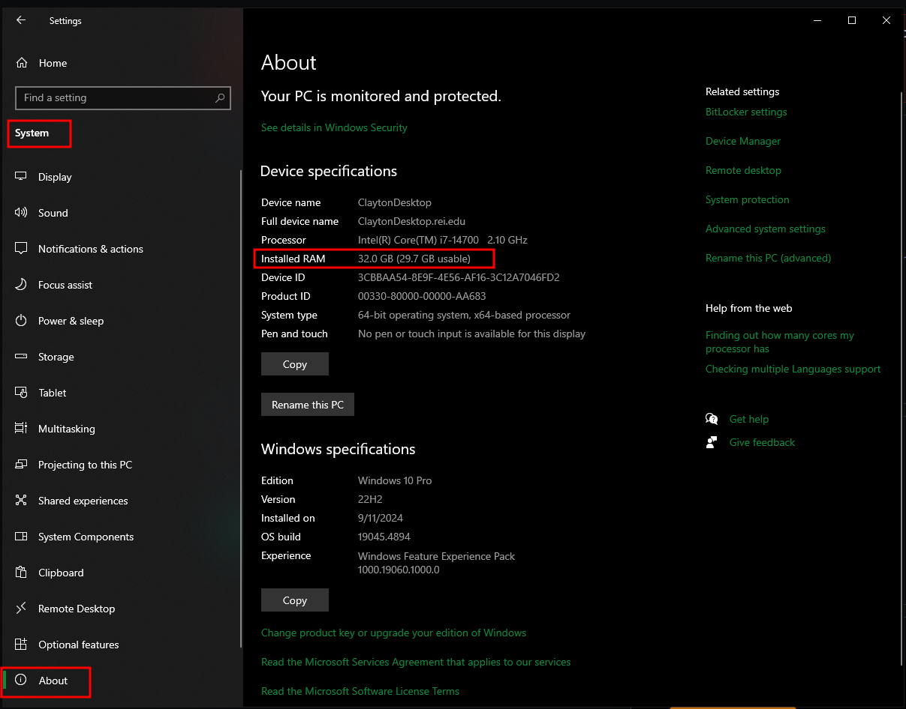
    - 8gb RAM, allocate 4gb. Type in *4000* into *Maximum Memory Allocation*
    - 16gb RAM, allocate 10gb. Type in *10000* into *Maximum Memory Allocation*
    - 32gb RAM, allocate 24gb. Type in *24000* into *Maximum Memory Allocation*

### Installing Modpack in MultiMC Guide
Almost there bitch

0. Make sure you download the [modpack](https://claytonreardon.github.io/Minecraft-Site/CosmicClayton'sCosmicModpack.zip)
1. Once in MultiMC, click the *Add Instance* button in the top left

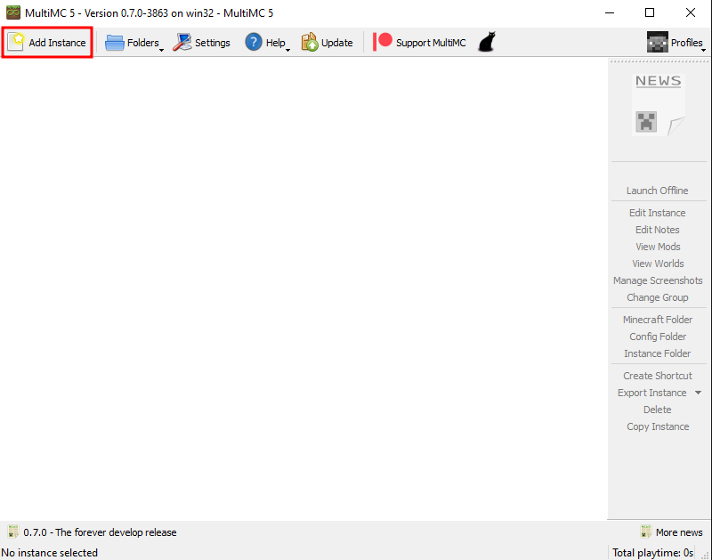

2. Select the *Import from zip* option, and then click *Browse*

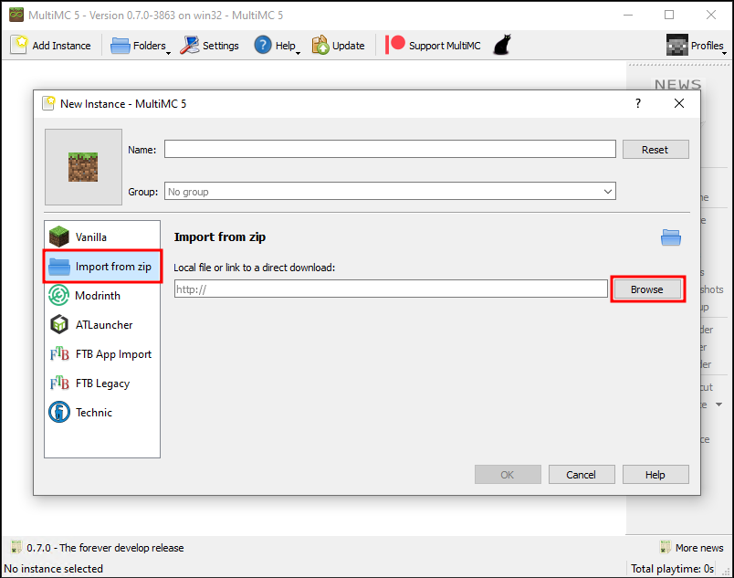

3. Browse to your *Downloads* folder and select *CosmicClayton'sCosmicModpack.zip*, then click *Open*

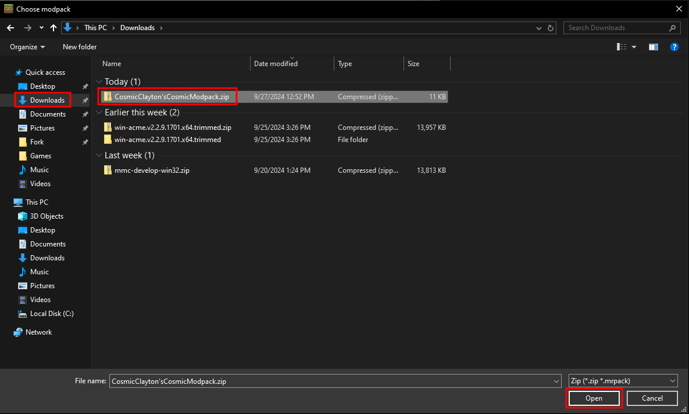

4. Rename the Instance whatever you like and hit *OK*
5. A new instance will be created and all the mods will be automatically downloaded and installed
6. After that just click *Launch*

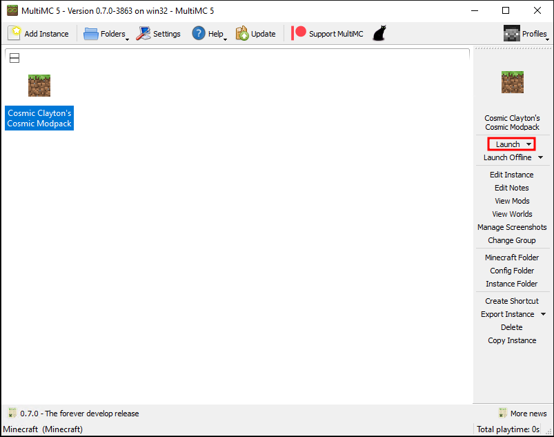

7. The first time you launch an instance, you'll be prompted to sign in to your Minecraft/Microsoft account. Select *Yes* to the option to open the account manager
8. Select *Add Microsoft*

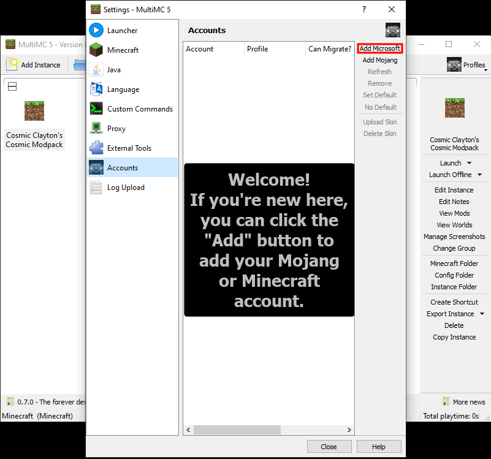

9. Copy the code given, and click on the link

10. Once your browser opens up, input the code

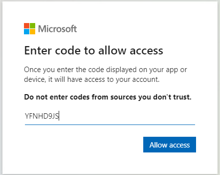

11. Sign in to your Microsoft account

